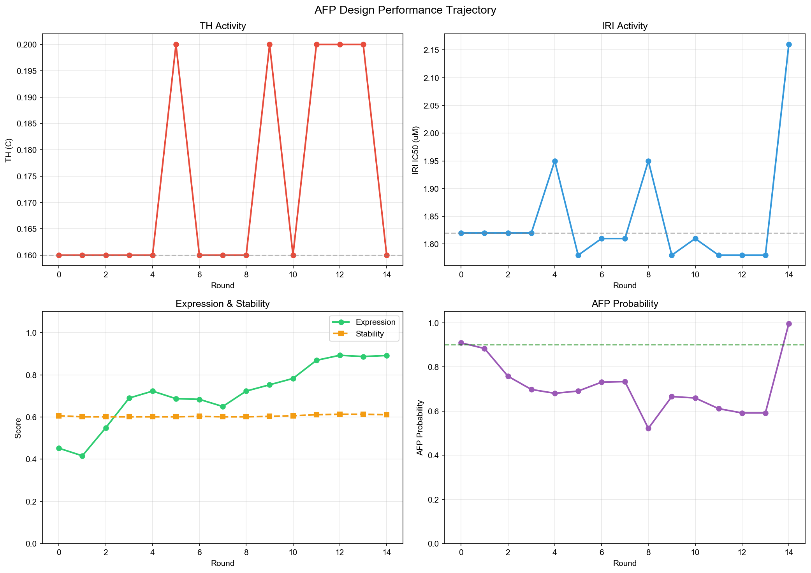

# 🧬 AFP 抗冻蛋白智能设计 — 最终报告

**会话 ID**: `20260705_152914_2d559081`  
**生成时间**: 2026-07-05 15:38:15  
**设计目标**: 序列: DTASDAAAAAALTAANAKAAAELTAANAAAAAAATAR  
**应用场景**: cell_cryopreservation  
**总设计轮次**: 0  

---

## 1. 输入序列分析

| 属性 | 值 |
|------|-----|
| 原始序列 | `DTASDAAAAAALTAANAKAAAELTAANAAAAAAATAR` |
| 序列长度 | 37 aa |
| 基线 TH | 0.16 °C |
| 基线 IRI IC₅₀ | 1.82 µM |
| 基线 表达评分 | 0.452 |
| 基线 稳定性 | 0.606 |

---

## 2. 突变设计路径

> ⚠️ 本轮未执行突变设计。

---

## 3. 序列对比

| 项目 | 序列 |
|------|------|
| **原始序列** | `DTASDAAAAAALTAANAKAAAELTAANAAAAAAATAR` |
| **最终序列** | `DTASDAAAAAALTAANAKAAAELTAANAAAAAAATAR` |

---

## 4. 性能对比

| 指标 | 基线值 | 最终值 | 变化 |
|------|:------:|:------:|:----:|
| **TH (°C)** | 0.160 | 0.160 | +0.0% |
| **IRI IC₅₀ (µM)** | 1.82 | 1.82 | +0.0% |
| **表达评分** | 0.452 | 0.452 | +0.0% |
| **稳定性评分** | 0.606 | 0.606 | +0.0% |

---

## 6. 可视化

> 性能变化轨迹图包含 4 个子图：TH 活性、IRI 活性、表达/稳定性评分、AFP 概率趋势。

---

## 7. 设计经验总结

---

*报告由 AFP-Designer 自动生成 | 2026-07-05 15:38:15*
